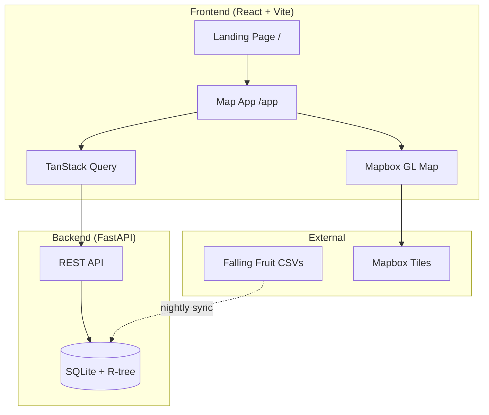
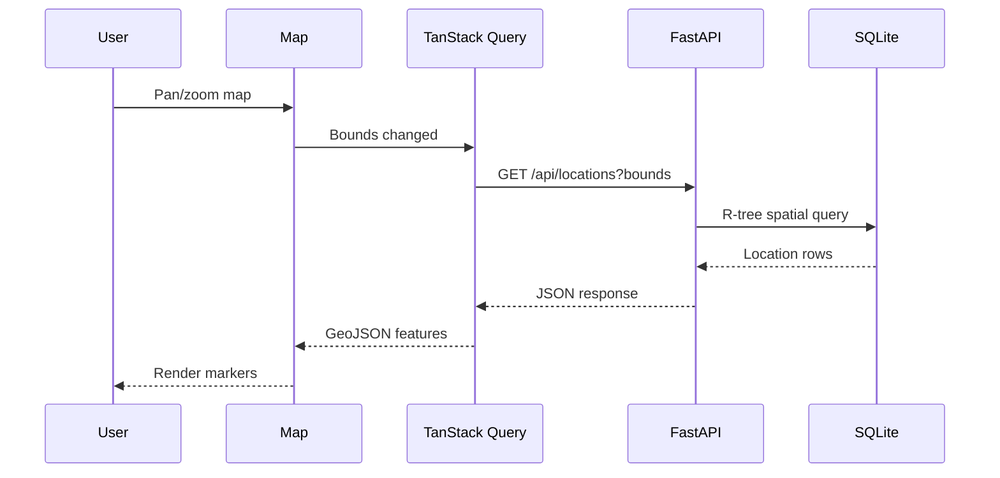
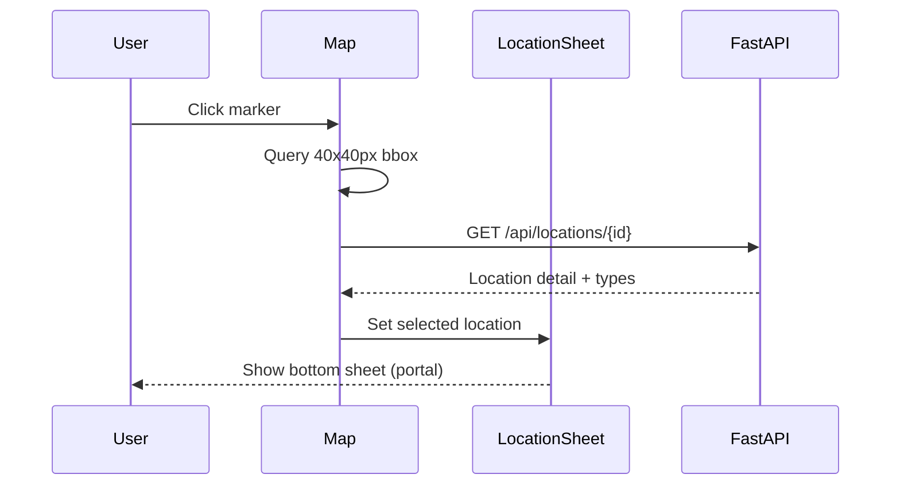
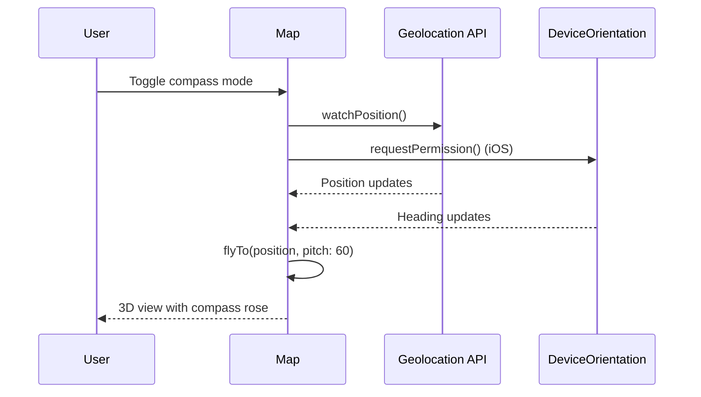

# Codebase Map

> Auto-generated by Cartographer. Last mapped: 2026-01-17

## System Overview



## Directory Structure

```
risingfruit/
├── backend/                 # FastAPI + SQLite backend
│   ├── db/
│   │   ├── schema.sql      # SQLite schema with R-tree index
│   │   └── import.py       # CSV to SQLite import script
│   ├── scripts/
│   │   └── sync-data.sh    # Download Falling Fruit CSVs
│   ├── src/
│   │   ├── main.py         # FastAPI app, all routes
│   │   └── database.py     # Async SQLite wrapper
│   ├── Dockerfile
│   ├── docker-compose.yml
│   └── nginx.conf          # Reverse proxy + SSL
│
├── frontend/                # React 19 + Vite PWA
│   ├── e2e/                 # Playwright E2E tests
│   │   ├── fixtures/       # Custom test fixtures
│   │   └── *.spec.ts       # Test files
│   ├── src/
│   │   ├── components/
│   │   │   ├── landing/    # Landing page sections
│   │   │   ├── Map.tsx     # Main Mapbox component (9.6k tokens)
│   │   │   ├── LocationSheet.tsx  # Bottom sheet details
│   │   │   ├── FilterPanel.tsx    # Season/verified filters
│   │   │   ├── SearchBar.tsx      # Plant type search
│   │   │   └── CompassRose.tsx    # 3D compass overlay
│   │   ├── lib/
│   │   │   ├── api.ts      # Backend API client
│   │   │   ├── colors.ts   # Centralized color system
│   │   │   ├── fruitSeasons.ts    # Season calculations
│   │   │   └── typeIdMappings.ts  # Type ID → icon mapping
│   │   ├── pages/
│   │   │   ├── LandingPage.tsx
│   │   │   └── AppPage.tsx
│   │   ├── types/
│   │   │   └── location.ts # TypeScript API types
│   │   ├── App.tsx         # Root with providers
│   │   ├── router.tsx      # Route definitions
│   │   └── theme.ts        # Mantine theme config
│   └── vite.config.ts      # Build + PWA config
│
├── docs/                    # Documentation
│   ├── architecture.md
│   ├── PRD.md
│   └── GAP_ANALYSIS.md
│
├── .github/workflows/
│   └── deploy.yml          # CI/CD to EC2
│
├── CLAUDE.md               # AI coding instructions
└── AGENT_CONTEXT.md        # Detailed project context
```

## Module Guide

### Backend: FastAPI + SQLite

**Purpose**: Self-hosted API serving Falling Fruit data with spatial queries

| File | Purpose | Tokens |
|------|---------|--------|
| src/main.py | FastAPI app, routes, Pydantic models | 2,070 |
| src/database.py | Async SQLite wrapper with R-tree queries | 2,060 |
| db/schema.sql | SQLite schema with R-tree index + triggers | 984 |
| db/import.py | Batch CSV import with progress reporting | 2,707 |
| scripts/sync-data.sh | Download/decompress Falling Fruit CSVs | 760 |

**Key APIs**:
- `GET /api/locations` - Bounding box query with R-tree
- `GET /api/locations/{id}` - Single location with types
- `GET /api/types` - Plant types with search/filter
- `GET /api/stats` - Database statistics

**Database Schema**:
- `locations` - ~2M foraging locations
- `types` - ~4K plant/food types
- `location_types` - Many-to-many junction
- `locations_rtree` - Virtual R-tree index (auto-synced via triggers)

**Environment Variables**:
- `DATABASE_PATH` - SQLite file (default: `/app/data/risingfruit.db`)
- `PORT` - API port (default: `8000`)

**Gotchas**:
1. R-tree stores points as min=max for single coordinates
2. Triggers dropped during bulk imports for performance
3. WAL mode + 64MB cache for SQLite performance
4. CORS wide open (should restrict in production)

---

### Frontend: React + Mapbox

**Purpose**: Mobile-first PWA for urban foraging map

#### Core Components

| File | Purpose | Tokens |
|------|---------|--------|
| components/Map.tsx | Main Mapbox map with clustering, markers, 3D mode | 9,636 |
| components/LocationSheet.tsx | Bottom sheet for location details (portal) | 2,939 |
| components/SearchBar.tsx | Plant type search with autocomplete | 1,827 |
| components/FilterPanel.tsx | Season and verified filters | 1,102 |
| components/CompassRose.tsx | 3D compass overlay for orientation mode | 1,478 |
| components/FruitIcons.ts | Pre-rendered SVG/emoji marker icons | 5,848 |

**State Management**:
- TanStack Query for server state (locations, types, stats)
- Local useState for UI state (selected location, filters, map view)

**Data Flow**:
1. Map bounds change → TanStack Query key updates
2. API request with bounds + filters
3. Response converted to GeoJSON
4. Mapbox renders clusters + markers
5. Marker click → fetch location detail → open sheet

**Gotchas**:
1. LocationSheet uses React Portal + inline z-index to render above Mapbox canvas
2. 3D animation state updates deferred until after flyTo completes
3. iOS requires user gesture for DeviceOrientationEvent.requestPermission()
4. Click uses 40x40px bounding box for mobile touch targets

#### Landing Page Components

| File | Purpose | Tokens |
|------|---------|--------|
| landing/Navbar.tsx | Fixed header with mobile drawer | 799 |
| landing/Hero.tsx | Full-screen hero with CTA | 717 |
| landing/Features.tsx | Feature grid showcase | 644 |
| landing/LiveStats.tsx | Live database statistics | 784 |
| landing/Screenshots.tsx | App screenshot placeholders | 655 |
| landing/Founder.tsx | Founder bio card | 702 |
| landing/Contact.tsx | Contact section | 456 |
| landing/Footer.tsx | Site footer | 431 |

#### Library Files

| File | Purpose | Tokens |
|------|---------|--------|
| lib/api.ts | Typed fetch wrappers for backend API | 571 |
| lib/colors.ts | Centralized color system (primary/accent/surface) | 1,009 |
| lib/fruitSeasons.ts | USDA-based harvest season data for 44+ types | 1,557 |
| lib/typeIdMappings.ts | 200+ Falling Fruit type IDs → 44 icon names | 2,128 |

---

### Tests: Playwright E2E

| File | Purpose | Tokens |
|------|---------|--------|
| e2e/fixtures/test-fixtures.ts | Custom fixtures with map helpers | 849 |
| e2e/marker-click.spec.ts | Marker interaction tests | 3,206 |
| e2e/markers.spec.ts | Marker rendering tests | 1,200 |
| e2e/filters.spec.ts | Filter panel tests | 1,111 |
| e2e/search.spec.ts | Search functionality tests | 703 |
| e2e/map.spec.ts | Basic map loading tests | 496 |

**Test Patterns**:
- Sequential execution (1 worker) due to shared map state
- 60s timeouts for slow Mapbox loads
- Custom `waitForMarkersToLoad()` fixture
- Conditional assertions (some tests silently pass)

---

### CI/CD: GitHub Actions

**Pipeline Stages**:
1. Checkout code
2. Build frontend with MAPBOX_TOKEN
3. SSH to EC2 with retry logic
4. Install/update Docker + Compose
5. rsync backend/ and frontend/dist/
6. docker compose build --no-cache
7. Verify with curl tests

**Required Secrets**: `EC2_HOST`, `EC2_USER`, `EC2_SSH_KEY`, `MAPBOX_TOKEN`

---

## Data Flow Diagrams

### Location Query Flow



### Marker Click Flow



### 3D Compass Mode Flow



## Conventions

### Code Style
- TypeScript strict mode
- React functional components with hooks
- Mantine UI components
- TanStack Query for data fetching
- Async/await throughout

### Naming
- Components: PascalCase (e.g., `LocationSheet.tsx`)
- Utilities: camelCase (e.g., `fruitSeasons.ts`)
- API routes: kebab-case (e.g., `/api/locations`)
- Types: PascalCase with Detail suffix (e.g., `LocationDetail`)

### File Organization
- One component per file
- Types co-located in `types/` directory
- Shared utilities in `lib/`
- Tests mirror source structure in `e2e/`

## Critical Gotchas

1. **LocationSheet Portal**: Must use React Portal with inline z-index to render above Mapbox canvas (Tailwind classes don't work)

2. **3D Mode Animation**: State updates must be deferred until after `flyTo` animation completes, otherwise React re-renders cancel the animation

3. **iOS Permissions**: `DeviceOrientationEvent.requestPermission()` requires user gesture (button click)

4. **Click Tolerance**: Marker clicks use 40x40px bounding box query, not point query, for mobile touch targets

5. **R-tree Point Format**: Single coordinates stored as min=max in R-tree virtual table

6. **Import Triggers**: R-tree triggers dropped during bulk imports, must be recreated after

7. **Season Data**: Uses US growing regions - may not be accurate for other locations

8. **API Base URL**: Empty string in production for same-origin, falls back to risingfruit.com in dev

9. **PWA Start URL**: `/app` - opens directly to map, bypassing landing page

10. **user-scalable=no**: Prevents pinch zoom (accessibility concern, but required for iOS PWA)

## Navigation Guide

**To add a new API endpoint**:
1. Add route in `backend/src/main.py`
2. Add Pydantic models in same file
3. Add database query in `backend/src/database.py`
4. Add TypeScript types in `frontend/src/types/location.ts`
5. Add fetch wrapper in `frontend/src/lib/api.ts`

**To add a new map feature**:
1. Modify `frontend/src/components/Map.tsx`
2. Add state management (useState or TanStack Query)
3. Add E2E test in `frontend/e2e/`

**To add a new plant icon**:
1. Add mapping in `frontend/src/lib/typeIdMappings.ts`
2. Add icon definition in `frontend/src/components/FruitIcons.ts`
3. Optionally add season data in `frontend/src/lib/fruitSeasons.ts`

**To add a landing page section**:
1. Create component in `frontend/src/components/landing/`
2. Import and add to `frontend/src/pages/LandingPage.tsx`
3. Add nav link in `frontend/src/components/landing/Navbar.tsx`

**To modify filters**:
1. Update `frontend/src/components/FilterPanel.tsx`
2. Update query params in `frontend/src/components/Map.tsx`
3. Update API query in `backend/src/main.py` if needed

**To run tests**:
```bash
cd frontend
npm test              # Run all E2E tests
npm run test:ui       # Playwright UI mode
npx playwright test markers.spec.ts  # Single file
```

**To deploy**:
- Push to `main` branch triggers GitHub Actions
- Or manually trigger via workflow_dispatch
